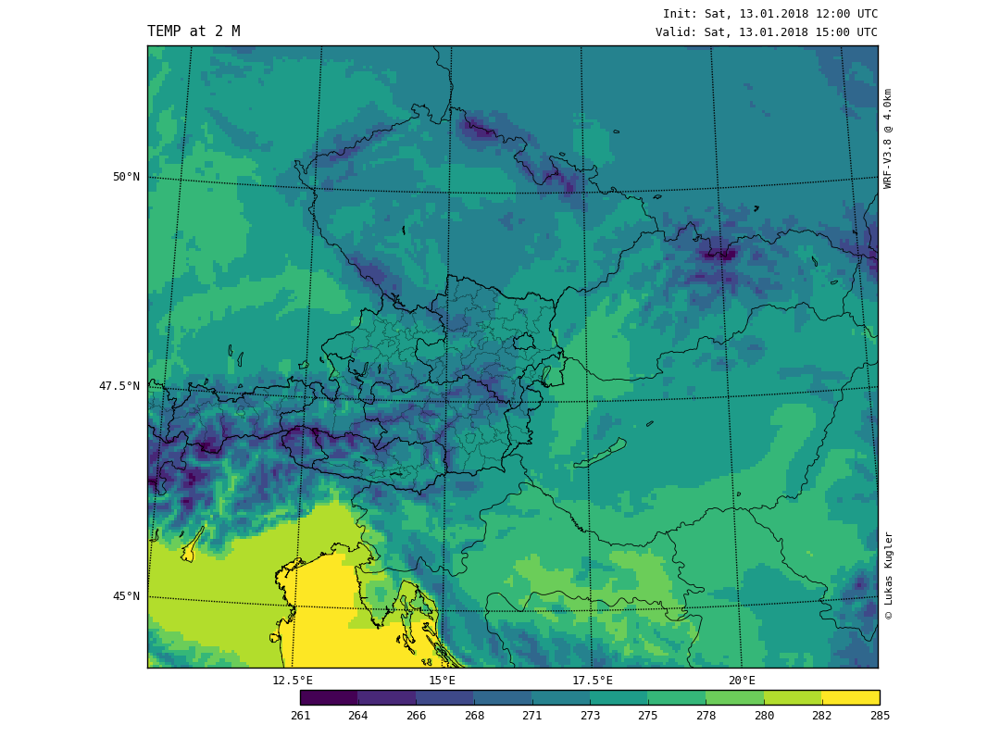

# EasyWRF
Plot standard meteorological variables from wrfout files using wrf-python.


## Example
To plot fields in wrfout files, use

```
import EasyWRF
ThisWRF = EasyWRF.Load_Domain('./wrfout_dir/', 'DomainName')

ThisWRF.plot('HGT')      # variables available within wrfout file
ThisWRF.plot_derived('BT')  # calculated Brightness Temperature from OLR
```


### Sensitivity Experiment
To compare two directories with wrfout.nc files in them, use
```
EasyWRF.Compare_Experiments(('./case1-wrfouts/', './case2-wrfouts/'),
                            'testdomain',
                            variables = ['OLR', ],
                            )
```